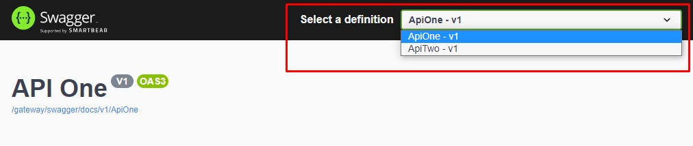

# MyDocker-Gateway

This is a sample implementation of a gateway using Ocelot.
To find out more about Ocelot, you can check their official [documentation](http://ocelot.readthedocs.io/) and their [repository](https://github.com/TomPallister/Ocelot).

## Pre-requisites

* Docker
* Docker Compose

## Running Application

Run the following shell command to boot up this application

```shell
# Windows Users and Root Linux Users
docker-compose -p gateway up -d

# Non-root Linux Users
sudo docker-compose -p gateway up -d
```

## Using Swagger For Ocelot

Access: <https://api.netboot.fr/docs/index.html>

## You can choose which API Swagger to use

